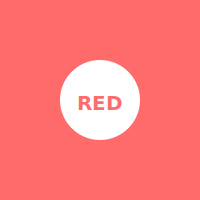
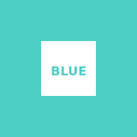

# Cards with Images Example

These cards reference the image files: red-circle.svg and blue-square.svg
Make sure to select both the markdown file AND the image files when importing.

---
tags: [colors, shapes]
---

What color is this shape?

===

Red

---
tags: [colors, shapes]
---

What shape is this?

===

A square

---
tags: [colors, shapes]
---

Identify both the color and shape:

===

This is a **red circle**.

The circle is a 2D shape where all points are equidistant from the center.

---
tags: [colors, comparison]
---

Compare these two shapes:

Front has red circle:

Back has blue square:

===

**Differences:**
- Shape: Circle vs Square
- Color: Red vs Blue

**Circle:** Round, no corners
**Square:** Four equal sides, four right angles

You can reference images on both sides!

